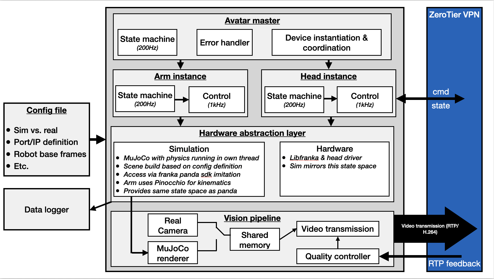

# Teleoperation Avatar

Robot-side C++ backend for the bimanual teleoperation system. Receives operator commands from the [VR interface](https://github.com/AlexanderWegenerRobotics/teleop-vr-interface), runs per-device state machines and control loops, and streams live video back over RTP/H.264. Supports both a MuJoCo simulation backend and real Franka hardware — selected at compile time.

> **Status: active development** — simulation backend is fully functional; real-hardware integration is ongoing.

---

## What this does

The avatar runs as two independent processes launched together via `launch.sh`: the **control process** (`avatar`) and the **video streamer** (`avatar_streamer`). These are intentionally decoupled — the streamer writes frames from shared memory regardless of what the control loop is doing, and the control loop runs regardless of stream health.

The control process instantiates the scene from config, starts a per-device control thread for each arm, head, and gripper, and runs an avatar-level state machine that coordinates across all devices. Each arm runs its own 200 Hz state machine for safety and falls back gracefully if a fault is detected — the keep-running design means a faulted device is detached and the remaining devices continue operating. MuJoCo runs at 1 kHz matching the real Panda arm; the avatar master and state machines run at 200 Hz (planned bump to 500 Hz). Arms switch between joint position control and Cartesian impedance control depending on state; forward kinematics are computed via Pinocchio.

The streamer picks up frames written into shared memory (either from the MuJoCo renderer or a RealSense camera), embeds a 64-bit wall-clock timestamp and frame ID for end-to-end latency measurement, and sends them via GStreamer over RTP/H.264. A stream health monitor runs in parallel and drives an adaptive quality controller that degrades bitrate, FPS, and FEC level to keep streaming alive under poor network conditions. Both machines connect over ZeroTier VPN and sync clocks via NTP for accurate latency computation.

---

## System diagram



---

## Backend modes

The backend is selected at CMake configure time:

| Flag | Effect |
|------|--------|
| `BUILD_WITH_MUJOCO=ON` *(default)* | MuJoCo simulation — no hardware required |
| `BUILD_WITH_FRANKA=ON` | Real Franka arm via libfranka — disables MuJoCo |

The MuJoCo backend mirrors the libfranka state space exactly (joint positions, velocities, external torques, Cartesian pose) so switching to real hardware requires no changes in the control or networking code.

---

## Scene configuration

The scene is fully defined in YAML — no recompile needed to change the robot layout, add objects, or adjust control gains. The top-level `config/config.yaml` points to three sub-configs:

**`config/robot_config.yaml`** — devices and networking

```yaml
devices:
  - name: arm_left
    type: arm
    enabled: true
    transmission:
      remote_ip: "10.x.x.x"
      send_port: 8001
      receive_port: 7001
      frequency: 200
    base_pose:
      position: [0, 0.4, 0.8]
      orientation: [0.5, -0.5, 0.5, -0.5]
    q0: [-0.3, -1.1, 0.3, -2.0, 0.5, 2.9, -0.9]
    control:
      kp_cart: [1000, 1000, 1000, 80, 80, 80]
      kd_cart: [70, 70, 70, 10, 10, 10]
      motion_scale: 2.0
    safety:
      workspace_min: [0.20, -0.55, 0.05]
      workspace_max: [0.85,  0.55, 0.75]
```

Adding a second arm or a head is a matter of appending another `devices` entry. Any device can be individually disabled with `enabled: false`.

**`config/sim_config.yaml`** — MuJoCo scene and object placement

```yaml
simulation:
  timestep: 0.001          # 1 kHz
  control_frequency: 1000

objects:
  - name: box_1
    type: dynamic
    model_path: "../models/mujoco/props/box_red.xml"
    pose:
      position: [0.8, 0.0, 0.6]
      orientation: [1, 0, 0, 0]
```

Static, dynamic, visual, and mocap object types are supported. Objects are assembled into a single MuJoCo scene at startup by `scene_builder` — no manual XML editing required.

**`config/streamer_config.yaml`** — video pipeline

```yaml
source_type: "mujoco"    # or "realsense"
bitrate_kbps: 2000
fec_percentage: 10
fps: 30
stream_width: 1280
stream_height: 960
port: 5004
feedback_port: 5005
```

---

## Repository structure

```
teleop-simulator/
├── src/
│   ├── main.cpp                        # Entry point: loads config, starts Avatar
│   ├── avatar.cpp                      # Master state machine + device coordination
│   ├── arm_control.cpp                 # Per-arm control loop (200 Hz SM, 1 kHz torque)
│   ├── head_control.cpp                # Pan-tilt control
│   ├── interpolator.cpp                # Command interpolation
│   ├── network/
│   │   ├── udp_transport.cpp           # Raw UDP send / receive
│   │   └── udp_reliable.cpp            # ACK + retransmit for high-level commands
│   ├── sim_env/
│   │   ├── simulation.cpp              # MuJoCo thread (1 kHz)
│   │   ├── scene_builder.cpp           # Assembles scene XML from config at startup
│   │   ├── robot.cpp                   # libfranka-compatible robot interface
│   │   ├── gripper.cpp                 # Gripper actuation
│   │   ├── model.cpp                   # Pinocchio FK wrapper
│   │   └── tum_head_driver.cpp         # Custom pan-tilt hardware driver
│   └── streamer/
│       ├── streamer_main.cpp           # Streamer entry point
│       ├── video_streamer.cpp          # GStreamer H.264 RTP pipeline
│       ├── stream_quality_controller.cpp # Adaptive bitrate / FPS / FEC
│       ├── camera_source.cpp           # MuJoCo shared-memory frame source
│       └── realsense_source.cpp        # RealSense camera frame source
├── include/                            # Headers (mirrors src/ layout)
├── config/
│   ├── config.yaml                     # Top-level: points to sub-configs
│   ├── robot_config.yaml               # Devices, control gains, UDP ports
│   ├── sim_config.yaml                 # MuJoCo scene, cameras, objects
│   └── streamer_config.yaml            # Video pipeline parameters
├── models/
│   ├── mujoco/
│   │   ├── robots/franka_fr3/          # FR3 torque-control MJCF (MuJoCo Menagerie)
│   │   ├── robots/franka_panda/        # Panda MJCF
│   │   ├── robots/pan_tilt_dummy/      # Custom pan-tilt model
│   │   └── props/                      # Table, wall, boxes, target frames
│   └── urdf/franka_fr3/               # URDF for Pinocchio FK
├── cmake/
│   ├── options.cmake                   # BUILD_WITH_FRANKA / BUILD_WITH_MUJOCO flags
│   └── dependencies.cmake
├── analysis/
│   ├── notebooks/
│   │   ├── inspect_episode.ipynb       # Per-episode log viewer
│   │   └── read_logging.ipynb          # Full session log reader
│   └── utils/common.py
├── tests/
│   ├── arm_tester.py                   # Send test commands to a running avatar
│   ├── test_stream_quality.py          # Stream health / quality controller tests
│   └── test_transmission.py            # UDP channel tests
├── docs/
│   └── system_overview_avatar.png      # Architecture diagram
├── launch.sh                           # Start avatar + avatar_streamer together
└── CMakeLists.txt
```

---

## Build

### 1. Clone

```bash
git clone https://github.com/AlexanderWegenerRobotics/teleop-simulator.git
cd teleop-simulator
mkdir build && cd build
```

### 2. Configure

**Simulation only (no hardware required):**
```bash
cmake .. -DBUILD_WITH_MUJOCO=ON -DBUILD_WITH_FRANKA=OFF -DMUJOCO_ROOT=/path/to/mujoco
```

**Real Franka hardware:**
```bash
cmake .. -DBUILD_WITH_MUJOCO=OFF -DBUILD_WITH_FRANKA=ON
```

### 3. Build

```bash
cmake --build . --config Release
```

This produces two binaries: `build/avatar` and `build/avatar_streamer`.

---

## Running

```bash
./launch.sh
```

This starts `avatar` and `avatar_streamer` as background processes and shuts both down cleanly on Ctrl+C. To run them individually for debugging:

```bash
./build/avatar &
./build/avatar_streamer
```

---

## Networking & clock sync

Both the avatar computer and the operator computer connect over ZeroTier VPN. IPs and ports are set in `config/robot_config.yaml` and `config/streamer_config.yaml`.

For accurate one-way latency measurement, clocks must be synchronized via NTP. On macOS:

```bash
sudo mkdir -p /var/run/chrony
sudo /opt/homebrew/sbin/chronyd -f /opt/homebrew/etc/chrony.conf
chronyc tracking   # verify sync
```

---

## Logging

Each session writes per-device CSV logs to `log/`:

| File | Contents |
|------|----------|
| `arm_left_log.csv` | Joint positions, velocities, external torques, EE pose, control mode, state — at control rate |
| `arm_right_log.csv` | Same for right arm |
| `head_log.csv` | Pan/tilt commands and state |
| `*_log_meta.csv` | Episode boundaries with pick/place config and outcome |

Analysis notebooks for reading and visualizing these logs are in `analysis/notebooks/`.

---

## Dependencies

| Dependency | Purpose |
|------------|---------|
| MuJoCo | Physics simulation (1 kHz) |
| libfranka | Real Franka arm interface (optional) |
| Pinocchio | Forward kinematics |
| GStreamer | H.264 RTP video pipeline |
| Intel RealSense SDK | Camera source (optional) |
| Eigen3 | Linear algebra |
| yaml-cpp | Config parsing |
| msgpack-cxx | Command channel serialisation |
| Poco | Networking utilities |
| ZeroTier | VPN between avatar and interface computer |

---

## Contact

Alexander Wegener — [Alexander_wegener1998@yahoo.de](mailto:Alexander_wegener1998@yahoo.de)
